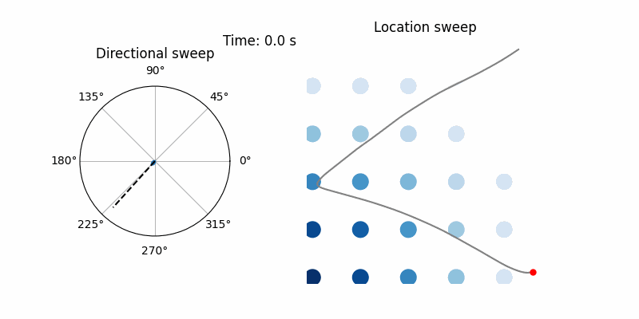

# ThetaSweepModelling

Computational models for theta sweeps and theta phase precession in spatial tuning cells.

This repository contains code and resources for simulating and analyzing theta sweeps and theta phase precession in spatial tuning cells, such as head direction cells, place cells, and grid cells.



### Installation

The package is not yet published to PyPI, so install it from source after cloning the repository:

```bash
pip install -e .
# or
uv pip install -e .
```

Add the `".[dev]"` extra if you also want the local testing and linting tools (`pytest`, `ruff`).

### Details of use

TBD 

(Examples are under the "notebooks" folder)

### Requirements

TBD

### The models are based on the following publications:

#### theta sweeps in  place cells:

Tianhao Chu\*, Zilong Ji\*, Junfeng Zuo, Yuanyuan Mi, Wen-hao Zhang, Tiejun Huang, Daniel Bush, Neil Burgess\#, and Si Wu\#. "Firing rate adaptation affords place cell theta sweeps, phase precession, and procession." Elife 12 (2024): RP87055.

### theta sweeps in theta-modulated head direction cells:

Zilong Ji\*, Eleonora Lomi\*, Kate Jeffery, Anna S. Mitchell, and Neil Burgess. "Phase Precession Relative to Turning Angle in Theta‐Modulated Head Direction Cells." Hippocampus 35, no. 2 (2025): e70008.

### Left-right theta sweeps in grid cells:

Zilong Ji\*, Tianhao Chu\*, Si Wu\#, and Neil Burgess\#. "A systems model of alternating theta sweeps via firing rate adaptation." Current Biology 35, no. 4 (2025): 709-722.


